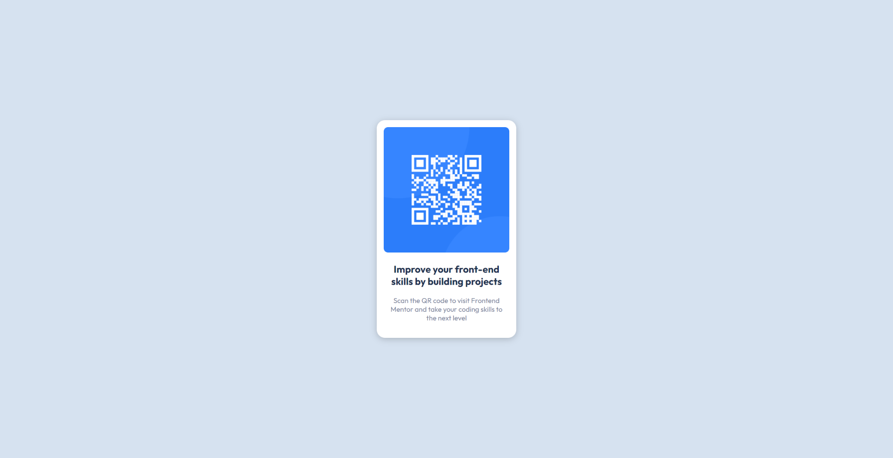
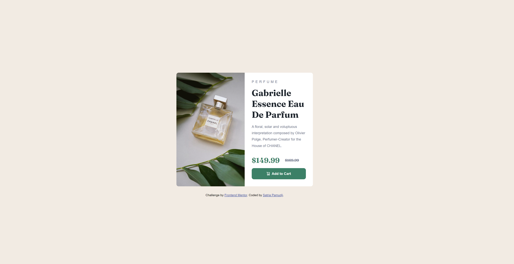
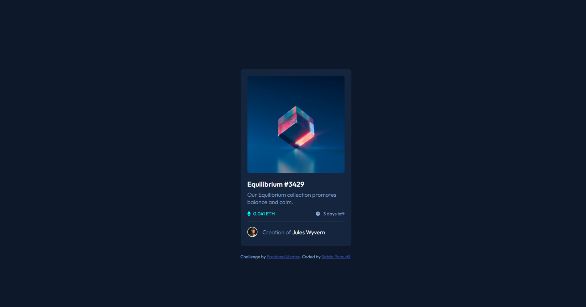

## Table of contents

- [Overview](#overview)
- [Challenge 1](#challenge-1-overview)
  - [Screenshot](#challenge-1-screenshot)
  - [What I learned](#challenge-1-what-i-learned)
- [Challenge 2](#challenge-2-overview)
  - [Screenshot](#challenge-2-screenshot)
  - [What I learned](#challenge-2-what-i-learned)
- [Challenge 3](#challenge-3-overview)
  - [Screenshot](#challenge-3-screenshot)
  - [What I learned](#challenge-3-what-i-learned)

# Overview

This repository will act as a portfolio for all of the challenges that I have done on Front End Mentor.

## Challenge 1: Overview

[QR code component challenge on Frontend Mentor](https://www.frontendmentor.io/challenges/qr-code-component-iux_sIO_H)

For the first project, basically we were supposed to recreate a QR code page. This was a beginner challenge, and allowed me to make use of my newly learnt skills to built a real "website"

For this project, I built it with these:

- Semantic HTML5 Markup
- CSS custom properties
- Flexbox

### Challenge 1: Screenshot

### Challenge 1: What I learned

[Codebase](https://github.com/satriapamudji/frontendmentor-01-qr-code)

For this project, I was looking to make use of my knowledge that I learnt and apply it to a basic project, and this was what I came up with.

1. I realized when I started was that I tried to make it 2 divs (img and text) when it should have just been one. I think that's something I need to relearn/have more practice in.
2. One more thing I need to remember is how to import fonts into the project using links. I realized it was simply going to the font url, and then copy + pasting it instead of just pasting the master link.

## Challenge 2: Overview

[Product Preview Card Component](https://www.frontendmentor.io/challenges/product-preview-card-component-GO7UmttRfa)

In this second challenge, we had to create a product preview card component to make it look at close as the given product images.

For this project, I built it with these:

- Semantic HTML5 Markup
- CSS custom properties
- Flexbox

### Challenge 2: Screenshot

### Challenge 2: What I learned

[Codebase](https://github.com/satriapamudji/frontendmentor-02-product-preview-card-component)

This project was a bit of a challenge for me initially as I was just getting used to the whole HTML and CSS language. Here was the problems I faced:

1. The first problem I faced was with the scaling of the image on the left, as when I did "height: 100%", the image was stretched. I tried to mitigate this with "width: auto", but it still did not work. However, I figured out that "object-fit: cover" helped.
2. The second problem I faced was with the responsiveness from desktop to mobile. Initially, I set the breakpoint at 640px which was the standard. However, I chose to increase that to 665px so that there is no random scaling that happens due to the sizing of the text, which causes the container box to scale up.

## Challenge 3: Overview

[NFT Preview Card Component](https://www.frontendmentor.io/challenges/nft-preview-card-component-SbdUL_w0U/hub)

In this challenge, we had to create a NFT preview card component to make it look at close as the given images.

For this project, I built it with these:

- Semantic HTML5 Markup
- CSS custom properties
- Flexbox

### Challenge 3: Screenshot

### Challenge 3: What I learned

[Codebase](https://github.com/satriapamudji/frontendmentor-03-nft-card)

This project taught me about positioning and proper nesting. One of the issues I faced with this challenge was the fact that trying to center the elements for different breakpoints required different solutions.

1. For the web solution, I used a container as it was the easiest, while for the mobile, I used flexbox to center the card.
